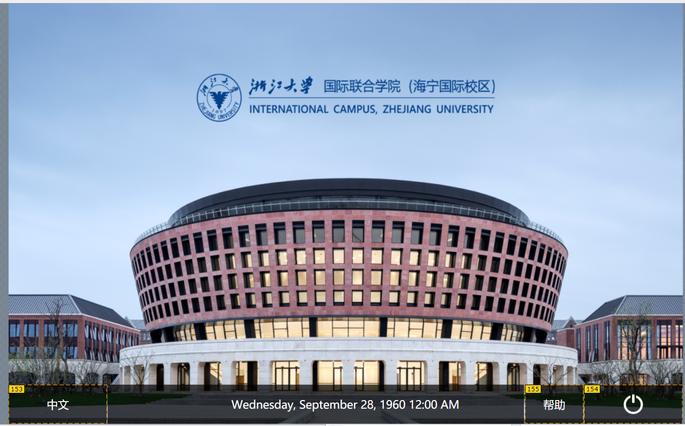
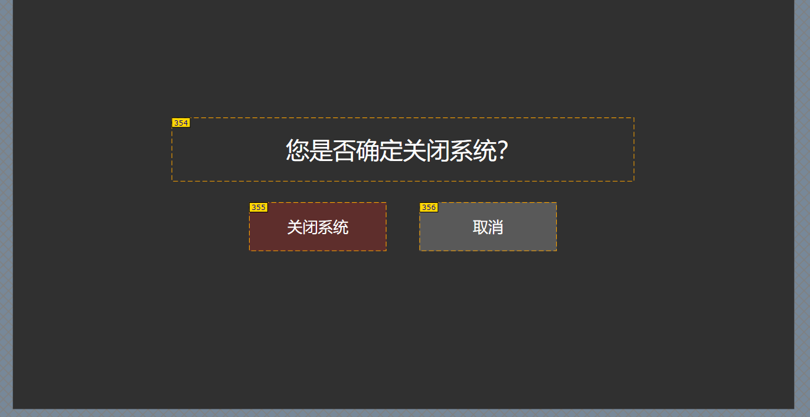
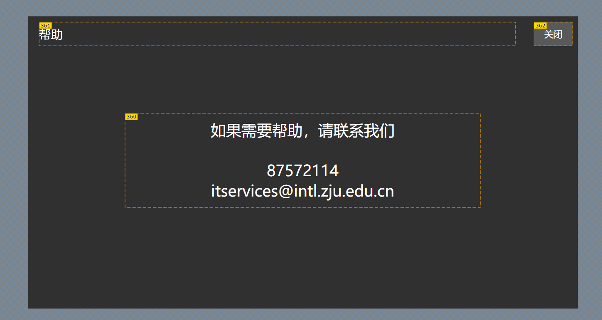
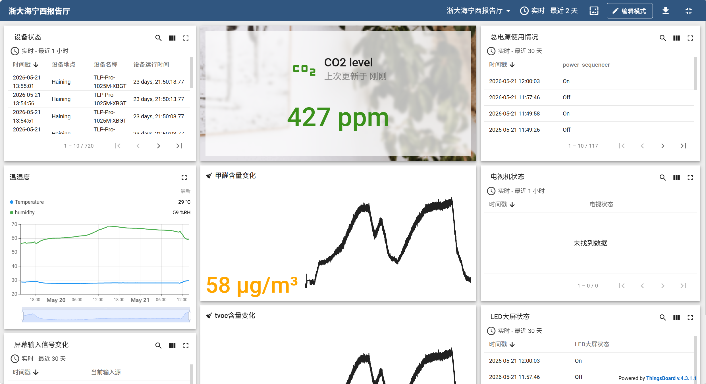

# Zhejiang University West Lecture Hall Extron Control System

> Platform: Extron IPCP Pro 350 + ControlScript Extension for VS Code

- [TOC]

---

## Project Overview

This project is the AV centralized control system for the West Lecture Hall of Zhejiang University, developed based on the Extron ControlScript framework and running on the IPCP Pro 350 controller. The system integrates video matrix switching, audio processing, recording/streaming, tracking camera, LED display, TV control, environmental sensor monitoring, and ThingsBoard IoT status reporting, and provides a bilingual (Chinese/English) touchscreen operation interface.

**Key Features:**

- One-key power on/off sequence control (power sequencing management)
- Video matrix multi-input/output switching (5 inputs × 6 outputs)
- TOT TIGER audio processor control (volume, mute, input selection)
- Extron SMP 351 recording system control (recording, live streaming)
- VISCA protocol tracking camera control
- LED relay switch control
- Three TV power controls (RS232/IR)
- Temperature/humidity/CO₂ environmental sensor data acquisition
- ThingsBoard platform IoT telemetry data reporting

---

## System Architecture

```
Touch Panel (TLP Pro 1025M)
        │ Ethernet
        ▼
IPCP Pro 350 ◄──────── IPL Pro S3
    │  │  │  │               │  │  │
  COM1 COM2 COM3 IRS1/IRS2 COM1 COM2 COM3
    │    │    │    │    │    │    │    │
Video Power Rec   BYOD  TV3  TV1  TV2  Audio
Matrix Seq  SMP351 Switcher   (RS232)(RS232) Processor
(RS232)(RS232)(RS232)(IR)(RS232)         (RS232/TOT)

Ethernet Devices:
  ├── Environmental Sensor (TCP 10.109.77.169:8002)
  ├── Tracking Camera (UDP 10.109.74.205:1259, VISCA)
  └── ThingsBoard (HTTP 10.105.5.170:8080)
```

---

## Hardware Device List

| Device Name | Model | Connection | IP / Port | Notes |
|-------------|-------|------------|-----------|-------|
| Main Controller | Extron IPCP Pro 350 | Ethernet | 10.109.74.169 | Alias IPCP350 |
| Serial Expander | Extron IPL Pro S3 | Ethernet | 10.109.74.229 | Alias IPLS3 |
| Touch Panel | Extron TLP Pro 1025M | Ethernet | 10.109.74.232 | Alias TLP1025M |
| Video Matrix | — | IPCP COM1, RS232 | — | 9600 8N1, proprietary protocol |
| Power Sequencer | — | IPCP COM2, RS232 | — | 9600 8N1, Extron protocol |
| Recording Host | Extron SMP 351 | IPCP COM3, RS232 | — | 9600 8N1, Extron protocol |
| BYOD Switcher | Crestron | IPCP IRS1, IR | — | IR control (effectively used as serial) |
| TV 3 | Philips | IPCP IRS2, IR | — | IR control (effectively used as serial), serial command |
| TV 1 | Philips | IPL COM1, RS232 | — | 9600 8N1, serial command |
| TV 2 | Philips | IPL COM2, RS232 | — | 9600 8N1, serial command |
| Audio Processor | TOT TIGER | IPL COM3, RS232 | — | 9600 8N1, proprietary protocol |
| LED Relay | — | IPCP RLY1 | — | Relay control |
| Environmental Sensor | — | Ethernet TCP | 10.109.77.169:8002 | Modbus-like protocol |
| Tracking Camera | VISCA | Ethernet UDP | 10.109.74.205:1259 | VISCA protocol |
| ThingsBoard | — | HTTP REST | 10.105.5.170:8080 | IoT platform |

---

## Network Topology

```
LAN 10.109.74.x / 10.109.77.x
│
├── 10.109.74.169   IPCP Pro 350 (Main Controller)
├── 10.109.74.229   IPL Pro S3 (Serial Expander)
├── 10.109.74.232   TLP Pro 1025M (Touch Panel)
├── 10.109.74.205   Tracking Camera (UDP 1259)
└── 10.109.77.169   Environmental Sensor (TCP 8002)

IoT Reporting Network 10.105.x.x
└── 10.105.5.170    ThingsBoard Server (HTTP 8080)
```

---

## Directory Structure

```
ZU/
├── ZU.json                          # Project config (device list, version 0.0.3)
├── ZU-certification.dat             # Extron certification file
├── ZU-credential.dat                # Extron credential file
├── ir/                              # IR infrared driver file directory
├── sound/                           # Touch panel button sound directory
├── rfile/                           # UI resource file directory (images, etc.)
├── layout/
│   └── XBGT.gdl                     # TLP UI layout definition file
├── src/
│   ├── main.py                      # Entry point, calls system.Initialize()
│   ├── system.py                    # Core logic: device init, event binding
│   ├── devices.py                   # All device instantiation
│   ├── variables.py                 # Global constants (matrix mapping, serial command bytes)
│   ├── control/
│   │   └── av.py                    # VideoMatrix + AudioProcessor control classes
│   ├── ui/
│   │   └── tlp.py                   # All Button/Slider/MESet UI component definitions
│   └── modules/
│       ├── device/
│       │   ├── extr_sm_SMP_300_Series_v1_19_20_0.py   # Recording system driver
│       │   └── vsca_camera_Visca_v1_0_1_2.py           # VISCA camera driver
│       ├── helper/
│       │   └── ModuleSupport.py     # Helper utilities
│       └── project/
│           ├── thingsboard_power.py    # Power status IoT reporting
│           ├── thingsboard_sensor.py   # Environmental sensor data IoT reporting
│           ├── thingsboard_LED.py      # LED status IoT reporting
│           ├── thingsboard_TV.py       # TV status IoT reporting
│           └── martix.py              # Matrix switching status IoT reporting
├── *.png                            # UI screenshots (Chinese version interface)
```

---

## Core Module Description

### `main.py`

Program entry point, simply calls `system.Initialize()` to start the entire system.

### `devices.py`

Centralized instantiation of all hardware interfaces:

```python
from extronlib.device import ProcessorDevice, UIDevice
from extronlib.interface import SerialInterface, EthernetClientInterface, RelayInterface

IPCP     = ProcessorDevice('IPCP350')
IPL      = ProcessorDevice('IPLS3')
TLP1025M = UIDevice('TLP1025M')

video_matrix    = SerialInterface(IPCP, 'COM1', 9600, 8, 'None', 1, 'Off', 0, 'RS232')
power_sequencer = SerialInterface(IPCP, 'COM2', ...)
recording_system = extr_sm_SMP_300_Series.SerialClass(IPCP, 'COM3', Model='SMP 351')
byod_switcher   = SerialInterface(IPCP, 'IRS1', ...)
tv_3            = SerialInterface(IPCP, 'IRS2', ...)
relay_led       = RelayInterface(IPCP, 'RLY1')

tv_1            = SerialInterface(IPL, 'COM1', ...)
tv_2            = SerialInterface(IPL, 'COM2', ...)
audio_processor = SerialInterface(IPL, 'COM3', ...)

sensor           = EthernetClientInterface("10.109.77.169", 8002)
tracking_camera  = vsca_camera.SerialOverEthernetClass("10.109.74.205", 1259, 'UDP')
```

### `variables.py`

Defines all hardware constants, signal name mappings, and serial command byte strings:

```python
# Matrix signal names
MATRIX_INPUT_BYOD    = 'BYOD'
MATRIX_INPUT_DOC     = 'DOC'
MATRIX_INPUT_CAMERA  = 'Camera'
MATRIX_INPUT_FLOOR   = 'Floor Socket'
MATRIX_INPUT_DESKTOP = 'Desktop'

MATRIX_OUTPUT_LED        = 'LED'
MATRIX_OUTPUT_RECORDER   = 'luobo'
MATRIX_OUTPUT_RETURN_TV  = 'Mirroring TV'
MATRIX_OUTPUT_LEFT_TV    = 'Left TV'
MATRIX_OUTPUT_RIGHT_TV   = 'Right TV'
MATRIX_OUTPUT_CAPTURE    = 'CAIji'

# Power sequencer commands
POWER_SEQUENCER_ON  = b'\x48\x1A\x00\x01\x02\x00\x00\x4D'
POWER_SEQUENCER_OFF = b'\x48\x1A\x00\x01\x01\x00\x00\x4D'

# TV power commands (RS232)
TV_POWER_ON  = b'\x06\x01\x00\x18\x02\x1D'
TV_POWER_OFF = b'\x06\x01\x00\x18\x01\x1E'

# Environmental sensor read command
ENVIRONMENTAL_SENSOR_READ = b'\x01\x03\x00\x00\x00\x08\x44\x0C'
```

### `control/av.py`

Encapsulates video matrix and audio processor operations:

```python
# Matrix numeric port mapping
MATRIX_INPUT_NUMBERS = {
    'Camera': 7, 'Desktop': 9, 'DOC': 10, 'BYOD': 11, 'Floor Socket': 12
}
MATRIX_OUTPUT_NUMBERS = {
    'LED': 3, 'luobo': 4, 'Mirroring TV': 5,
    'Left TV': 6, 'Right TV': 7, 'CAIji': 8
}

class VideoMatrix:
    def route(self, input_name, output_name): ...  # Switch input to specified output

class AudioProcessor:
    def set_volume(self, level): ...
    def set_mute(self, state): ...   # state: 'On' / 'Off' (string, not boolean)
```

### `ui/tlp.py`

Defines all interactive controls (Button, Slider, MESet) on the touch panel for unified event handler binding in `system.py`.

---

## UI Interface Description

The system provides a bilingual Chinese/English interface. Chinese page names have a `_1` suffix, English versions have no suffix.

| Page | Screenshot | Description |
|------|------------|-------------|
| Start Page |  | System standby/welcome page |
| Starting Up |  | Power-on sequence in progress |
| Confirm Power On |  | Power on confirmation popup |
| Main Control |  | Multi-window main control page |
| Audio Settings |  | Volume/mute/input selection |
| Video Settings |  | Matrix switching/source selection |
| Confirm Power Off |  | Power off confirmation popup |
| Powering Down |  | Power-off sequence in progress |
| Help Page |  | Operation guide |

---

## Communication Protocols

### Video Matrix (RS232)

- Interface: IPCP COM1, 9600 8N1
- Protocol: Proprietary serial protocol, frame header `0x7B 0x7B`, frame trailer `0x7D 0x7D`
- Function: Input/output routing and switching

### Audio Processor TOT TIGER (RS232)

- Interface: IPL COM3, 9600 8N1
- Protocol: TOT TIGER proprietary serial protocol, frame header `0xA5 0xAB`
- Function: Volume control, mute control, input selection

### Recording System SMP 351 (RS232)

- Interface: IPCP COM3, 9600 8N1
- Driver: `extr_sm_SMP_300_Series_v1_19_20_0.py`
- Function: Recording start/stop, live streaming (RTMP)

### Tracking Camera (UDP)

- Interface: Ethernet UDP, 10.109.74.205:1259
- Protocol: VISCA over Ethernet
- Driver: `vsca_camera_Visca_v1_0_1_2.py`

### Environmental Sensor (TCP)

- Interface: Ethernet TCP, 10.109.77.169:8002
- Protocol: Modbus-like, request frame 21 bytes, frame header `0x01 0x03`
- Read command: `b'\x01\x03\x00\x00\x00\x08\x44\x0C'`
- Data: Temperature, humidity, CO₂ and other environmental parameters

### TV Control (RS232)

- TV1: IPL COM1, TV2: IPL COM2, TV3: IPCP IRS2
- Power on: `b'\x06\x01\x00\x18\x02\x1D'`
- Power off: `b'\x06\x01\x00\x18\x01\x1E'`

---

## ThingsBoard IoT Integration

The system reports device status to the ThingsBoard platform via HTTP REST API.

| Module | File | Device Token | Reported Content |
|--------|------|--------------|------------------|
| Power Status | `thingsboard_power.py` | `N61GJcet4ZAyOZ6BZheI` | System on/off status |
| Environmental Sensor | `thingsboard_sensor.py` | hQdDFoalNZSwgj7lNrsT | Temperature, humidity, CO₂ |
| LED Status | `thingsboard_LED.py` | 1PMwAXn0SgWPUhTxuDyz | LED relay status |
| TV Status | `thingsboard_TV.py` | IGeKi4fJVIuYaWbzlh2R | TV power status |
| Matrix Status | `martix.py` | `SlrUchlUCxC5qrq73FUj` | Current signal routing |

**Server Address:**
- Intranet domain: `things.intl.zju.edu.cn`
- Intranet IP: `10.105.5.170:8080`

**Reporting Format (HTTP POST):**
```http
POST /api/v1/{device_token}/telemetry
Content-Type: application/json
Authorization: Bearer {device_token}
{"key": "value"}
```

---

## Power On/Off Sequence

### Power On Sequence

1. Touch panel displays "Confirm Power On" popup
2. After user confirmation, enters "Starting Up" page
3. Sends `POWER_SEQUENCER_ON` command to `power_sequencer` (COM2)
4. Waits for devices to stabilize
5. Initializes video matrix default routing
6. Initializes audio processor default volume
7. Switches to main control interface
8. Reports power-on status via ThingsBoard

### Power Off Sequence

1. Touch panel displays "Confirm Power Off" popup
2. After user confirmation, enters "Powering Down" page
3. Stops recording system (if recording)
4. Turns off all TVs
5. Sends `POWER_SEQUENCER_OFF` command to `power_sequencer` (COM2)
6. Switches to standby page
7. Reports power-off status via ThingsBoard

---

## Video Matrix Signal Routing

### Input Sources

| Input Name | Matrix Port | Description |
|------------|-------------|-------------|
| Camera | 7 | Tracking camera |
| Desktop | 9 | Desktop PC |
| DOC | 10 | Document camera |
| BYOD | 11 | Wireless screen casting |
| Floor Socket | 12 | Floor HDMI socket |

### Output Destinations

| Output Name | Matrix Port | Description |
|-------------|-------------|-------------|
| LED | 3 | LED screen |
| luobo | 4 | Recording host (SMP 351) capture input |
| Mirroring TV | 5 | Mirroring TV |
| Left TV | 6 | Left TV |
| Right TV | 7 | Right TV |
| CAIji | 8 | Capture card |

---

## Audio System

The audio processor connects via IPL Pro S3 COM3 serial port, controlled using the TOT TIGER proprietary protocol:

- **Volume Control**: Range 0–100, corresponding dB values converted by the processor
- **Mute Control**: Channel-level mute, pass string `'On'`/`'Off'` when calling
- **Input Selection**: Switch between different audio sources (microphones, line inputs, etc.)

---

## Environmental Sensor

The sensor connects via TCP and polls data using a Modbus-like protocol:

```python
# Read command
READ_CMD = b'\x01\x03\x00\x00\x00\x08\x44\x0C'
# Returns 21-byte frame containing:
# Temperature (°C), Relative Humidity (%), CO₂ concentration (ppm), etc.
```

Collected data is periodically reported to the ThingsBoard platform and can be viewed on the dashboard or monitoring interface.



---

## Deployment and Debugging

### Requirements

- Extron ControlScript (extronlib) running on IPCP Pro 350
- Python syntax compatible with ControlScript interpreter (Python=3.5)
- Devices must be on the same LAN subnet (10.109.74.x / 10.109.77.x)

### Deployment Steps

1. Use `ControlScript Deployment Utility` to upload all files from the `src/` directory to IPCP Pro 350
2. Upload `layout/XBGT.gdl` to TLP Pro 1025M
3. Confirm serial port baud rates match those configured in `devices.py`
4. Verify network device IP addresses are reachable
5. Run `main.py` in the IPCP console to start the project

### Common Troubleshooting

| Symptom | Possible Cause | Solution |
|---------|---------------|----------|
| Audio mute command ineffective | `set_mute()` passed a boolean value | Use string `'On'`/`'Off'` instead |
| ThingsBoard report failed | Network unreachable or Token error | Check that IP `10.105.5.170:8080` is reachable and Token is correct |
| Audio initialization process hangs | Excessive `get_input_volume()` calls causing command flooding | Manually set preset values, e.g. `SetFill(-10.2)` |
| Environmental sensor no data | TCP connection disconnected | Check connectivity to `10.109.77.169:8002` |


